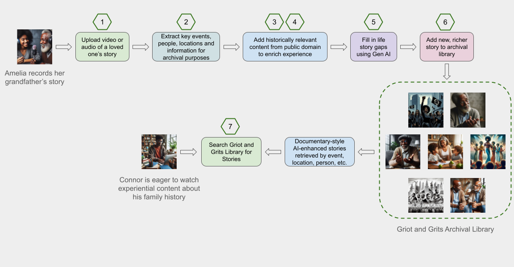

# Welcome to the Griot and Grits Project

**griot**  
noun <em> \[ gree-oh, gree-oh, gree-ot \] </em>  
:a member of a hereditary caste among the peoples of western Africa whose function is to keep an oral history of the tribe or village and to entertain with stories, poems, songs, dances, etc.  

**grits**  
noun <em> \[ grits \] </em>  
:a dish of coarsely ground corn kernels boiled with water or milk and then sometimes fried, eaten as a breakfast dish or as a side dish with meat. A staple in Southern cooking.

# Our Purpose
Griot and Grits is a new take on the West African Griot, the storytelling, singing, poet, historian of the village that was tasked with passing on the history of the village orally.  Our mission is to preserve the history of the African American experience one voice at a time using AI and other advanced technologies.  

The project aims to achieve the following objectives:  
+ Create a comprehensive, searchable library of recorded oral and video accounts of the lives of local African Americans.
+ Use AI to highlight key events from the recorded content and associate them with similar events to create a richer story.
+ Generate a geographical representation of the stories to allow individuals to search by location.
+ Recreate a documentary-like view of individual stories with the assistance of AI to augment key events with additional relevant background information, photos and videos.
+ Build referencable Family Chapters for individuals to find out more about their unique family history.

# The Story Behind the Griot and Grits Project  
<em>**Listen to Our Story**</em>  
  

# Work to Do  

The Griot and Grits Project will bring the African American experience to life for our generation and generations to come by building innovative technology that does the following:

  

1. Enable users to upload video and audio recordings to a [centralized repository](1-content-upload-storage/) or library.
2. [Extract metadata and key events](2-metadata-key-events-extraction/) from the uploaded content using AI.
3. [Enrich the metadata and key events](3-metadata-key-events-enrichment/) with information, videos, audio and pictures from the public domain using the assistance of AI.
4. [Annotate the uploaded video and audio recordings](4-original-content-annotator/) with the enriched content using AI.
5. Use the assistance of [Generative AI to further enhance](5-gen-ai-enrichment/) the enriched content with additional contextual information, videos, audio and/or pictures.
6. Build an [index of searchable content](6-searchable-catalog-builder/) based on the metadata and key events.
7. Allow users to [explore the indexed content](7-catalog-explorer/) via a search engine or a visual geographical map.

# A Conceptual Example
Here is a example of what we hope to do in the Griot and Grits project to enhance, enrich and contextualize African American stories with the assistance of AI.  The following was done manually and is purely conceptual.  

<em>**Before AI-assisted Enhancements**</em>  
  

<em>**After AI-assisted Enhancements (concept only)**</em>  
  

# Contributing to the Project  

There's a lot of work to do to get this project off the ground.  Your help is always welcome.  We need a project website, code to store and enhance content with AI, documentation, and much much more!  Just jump right in and start submitting some PRs to get the project moving.  If you're interested in joining as a member, reach out to us!

Check out the [docs](https://github.com/griot-and-grits/griot-and-grits/tree/main/docs)