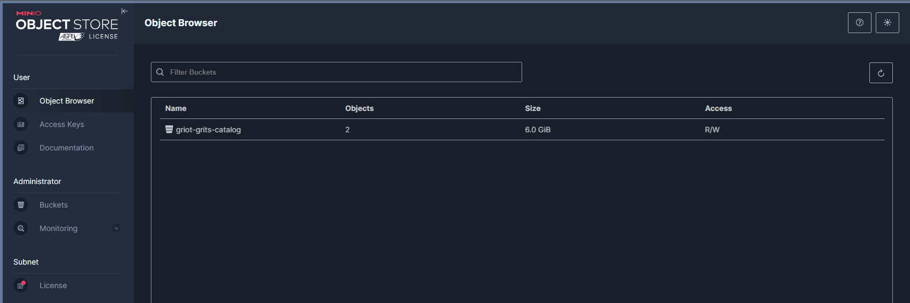
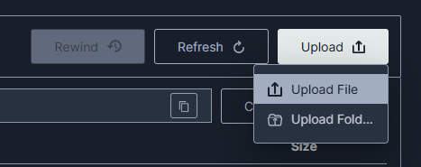
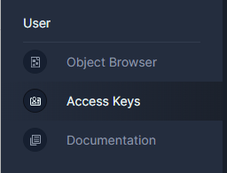
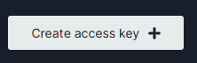
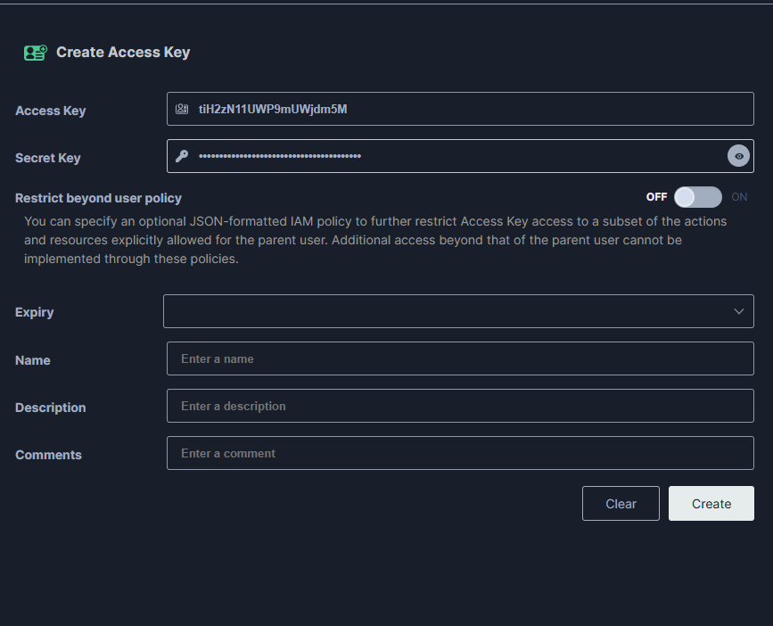

# Documentation for the griot-and-grits project lives here

...

## How to access the object storage through UI
Object storage is essentially like storing files on Google Drive, Dropbox, or even your computer. Except this one lives on the cluster and can be accessed programatically. This is a must so that we can access the files through our automation processes. 

The link to our object bucket is [here.](https://docs.google.com/document/d/13xZcWiSxArTcZDFHFsGuKeUelLZrV7RPO9xxu0UDaRU/)

Please ask Sherard Griffin (shgriffi@redhat.com) or Sidney Glinton (sglinton@redhat.com) for access.

Once you log in, you will be at a screen that shows a list of your buckets (or root folders if comparing to Google Drive)

We will most likely only be using the `griot-grits-catalog` bucket (or main folder)

Click into this bucket, and then you will see the additional folders within. You can upload files by hitting the `Upload` button in the top right corner.

For formatting instructions, please see `POC File Format` in this [doc.](https://docs.google.com/document/d/13xZcWiSxArTcZDFHFsGuKeUelLZrV7RPO9xxu0UDaRU/edit?usp=drive_link)

## How to create API Keys
Once logged in, click `Access Keys` on the side.

Click 

You will see this page

Give your access key a name and description if you so chose and copy down your access key and secret key. **Be ware that you will not see your keys again, so either click 
or write them down somewhere safe.

---
## Note: Please do not push this into any Git repos, do not share keys, they are for your purpose only!
